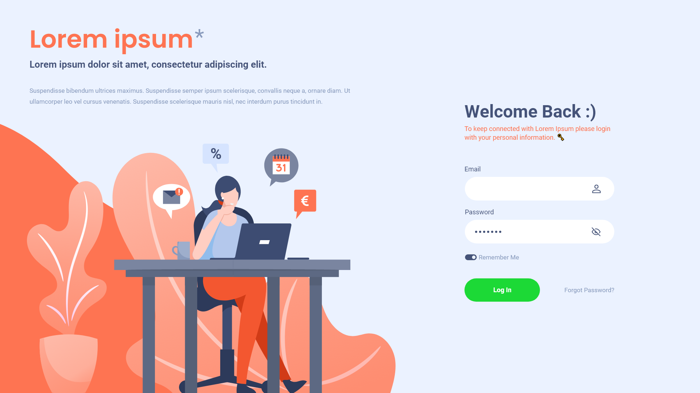

# Live Coding Challenge

This is a live coding challenge during a front-end
developer interview.

## You can find the demo <a href="https://amazing-newton-f3df80.netlify.app/">here</a>!

# Specifications

I was given the below `preview.png` with very few
details and was assigned to create the exact form
page in 1 hour.

## The preview:

## JS

No interaction was asked for this coding challenge.

## Responsive

Although the interviewer did not ask a responsive
design, I had the time to implement it. So, a basic
single `media query` was set in css
